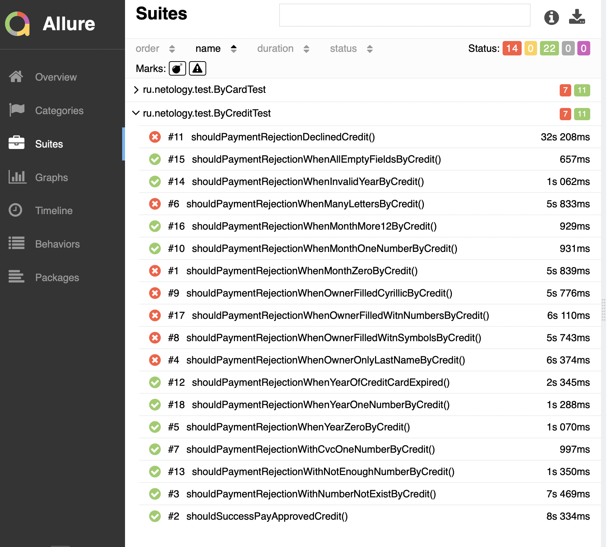

# Отчётные документы по итогам тестирования

В ходе тестирования был применен метод тест - кейсов, который проверяет работу веб-сервиса, взаимодействующего с СУБД и API Банка, для покупки тура с помощью двух способов:

- покупка через дебетовую карту
- покупка в кредит

Суть тестирования заключается в проверке работы всех обязательных полей сайта и их корректное отображение через позитивные и негативные сценарии покупки тура.

На ознакомительном этапе было проведено ручное тестирование для ознакомления с проектом.
На следующем этапе были созданы автоматизированные тесты, согласно [Плану тестирования](https://github.com/SvetlanaSvetina/Diploma/blob/master/documents/Plan.md) 

Тестирование было проведено для двух баз данных - MySQL и PostgreSQL.

### Отчет из фреймворка Allure

Всего было проведено 36 тест-кейсов:

Успешно пройден 61,11%, 22 успешно пройденных теста и 14 не успешных тестов:

### Общие рекомендации:

* Исправить выявленные ошибки по составленным [баг-репортам](https://github.com/SvetlanaSvetina/Diploma/issues/)

* Исправить текст сообщения в формах "Купить" и "Купить в кредит", если все поля формы пустые с ""Неверный формат" на сообщение "Поле обязательно для заполнения"

* Исправить текст сообщения в формах "Купить" и "Купить в кредит", если поле "Номер карты" оставить пустым c "Неверный формат" на сообщение "Поле обязательно для заполнения"

* Исправить текст сообщения в формах "Купить" и "Купить в кредит", если поле "Месяц" заполнено значением больше 12 с "Неверно указан срок действия карты" на сообщение "Поле обязательно для заполнения"

* Исправить текст сообщения в формах "Купить" и "Купить в кредит", если поле "Год" оставить пустым c "Неверный формат" на сообщение "Поле обязательно для заполнения"

* Убрать текст сообщения "Поле обязательно для заполнения" под полем "Владелец" в формах "Купить" и "Купить в кредит", когда значение в поле "CVC" пустое

* Сделать визуально одинаковыми кнопки "Купить" и "Купить в кредит", чтобы при нажатии они меняли цвет (красный - активная вкладка, белый неактивная)